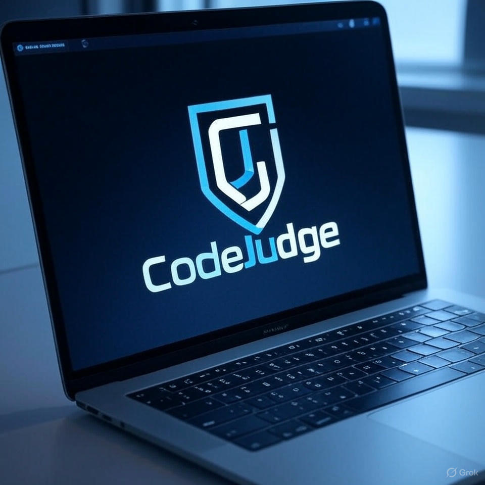

# CodeJudge

A sleek and modern online programming judge platform built with Laravel and TailwindCSS. Perfect for universities, coding bootcamps, and competitive programming enthusiasts.



## What makes CodeJudge special? 🌟

Unlike other online judges that feel clunky and outdated, CodeJudge brings a fresh perspective with its modern UI and seamless user experience. It's designed for both beginners and experienced programmers, making it perfect for educational institutions and coding competitions.

## Core Features

### For Problem Solvers 👨‍💻
- Crystal clear problem descriptions with formatted input/output examples
- Real-time submission feedback
- Personal submission history and statistics
- Problem difficulty indicators
- Sample test cases to get you started

### For Problem Setters 📝
- Intuitive problem creation interface
- Support for multiple test cases
- Custom input/output validation
- Problem templates to get started quickly
- Rich text editor for problem descriptions

### For Admins 🛠
- User management with role-based access
- Detailed submission logs
- Problem and contest analytics
- System health monitoring
- Easy backup and restore options

## Tech Stack

- **Backend**: Laravel 10.x
- **Frontend**: TailwindCSS + Alpine.js
- **Database**: MySQL
- **Cache**: Redis (optional)
- **Testing**: PHPUnit

## Quick Setup

1. Get the code
```bash
git clone https://github.com/yourusername/CodeJudge.git
cd CodeJudge
```

2. Install what you need
```bash
composer install
npm install
```

3. Set up your environment
```bash
cp .env.example .env
php artisan key:generate
```

4. Configure your database in `.env`
```
DB_CONNECTION=mysql
DB_HOST=127.0.0.1
DB_PORT=3306
DB_DATABASE=codejudge
DB_USERNAME=your_username
DB_PASSWORD=your_password
```

5. Set up the database and compile assets
```bash
php artisan migrate --seed  # This will create sample problems!
npm run build
```

6. Start coding!
```bash
php artisan serve
```

Visit `http://localhost:8000` and log in with:
- Email: admin@codejudge.com
- Password: password123

## Sample Problems

We've included 5 beginner-friendly problems to get you started:
1. Hello World
2. Sum of Two Numbers
3. Even or Odd
4. Reverse String
5. Count Vowels

Each problem comes with:
- Detailed descriptions
- Input/output formats
- Sample test cases
- Helpful explanations
- Multiple test cases

## Folder Structure

```
CodeJudge/
├── app/                 # Core application logic
│   ├── Http/           # Controllers & Middleware
│   ├── Models/         # Database models
│   └── Services/       # Business logic
├── database/
│   ├── migrations/     # Database structure
│   └── seeders/       # Sample data
├── resources/
│   ├── views/         # Blade templates
│   ├── css/          # Tailwind styles
│   └── js/           # Alpine.js components
└── tests/             # Test suites
```

## Contributing

Found a bug? Want to add a feature? Here's how:

1. Fork it
2. Create your feature branch (`git checkout -b feature/awesome-feature`)
3. Commit your changes (`git commit -m 'Add awesome feature'`)
4. Push to the branch (`git push origin feature/awesome-feature`)
5. Open a Pull Request

## Troubleshooting

Having issues? Here are some common fixes:

- **Can't connect to MySQL?** Make sure it's running: `sudo systemctl start mysql`
- **Permission issues?** Check directory permissions: `chmod -R 775 storage bootstrap/cache`
- **Assets not updating?** Clear the cache: `php artisan cache:clear && npm run build`

## License

This project is licensed under the MIT License - see the [LICENSE](LICENSE) file for details.

## Need Help?

- 📖 Check out our [Wiki](https://github.com/yourusername/CodeJudge/wiki)
- 🐛 Found a bug? [Open an issue](https://github.com/yourusername/CodeJudge/issues)
- 💬 Questions? Email us at support@codejudge.com

---
Made with ❤️ by developers, for developers
